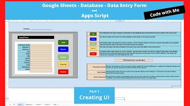

## Simulating a Data Base using Google APP script. 

  

In this project you will find the code I used to create the DB plus videos going through the code. 

<a href="https://youtu.be/1k6MMKC_2_U" target="_blank"> Part 1</a>  UI  
<a href="https://youtu.be/3RZC1bzFzBg" target="_blank"> Part 2</a>  Add Button 1 
<a href="https://youtu.be/FWFL6gkWtLc" target="_blank"> Part 3</a>  Add Button 2 
<a href="https://youtu.be/ViIghrkmrN8" target="_blank"> Part 4</a>  Clear All 
<a href="https://youtu.be/SoHUH7uitao" target="_blank"> Part 5</a>  Search Button 
<a href="https://youtu.be/t_zxX1sk9-E" target="_blank"> Part 6</a>  Delet Button 
<a href="https://youtu.be/NMVxQHD4ZoU" target="_blank"> Part 7</a>  Update Button 
<a href="https://youtu.be/nCCF6VG7ytw" target="_blank"> Part 8</a>  Customer Menus 

- <a href="https://github.com/kurtwp/kurtwp/blob/main/projects/googleGS/code.gs" target="_blank">code.gs</a>Main code for the simulated DB.  

Correct Repo
